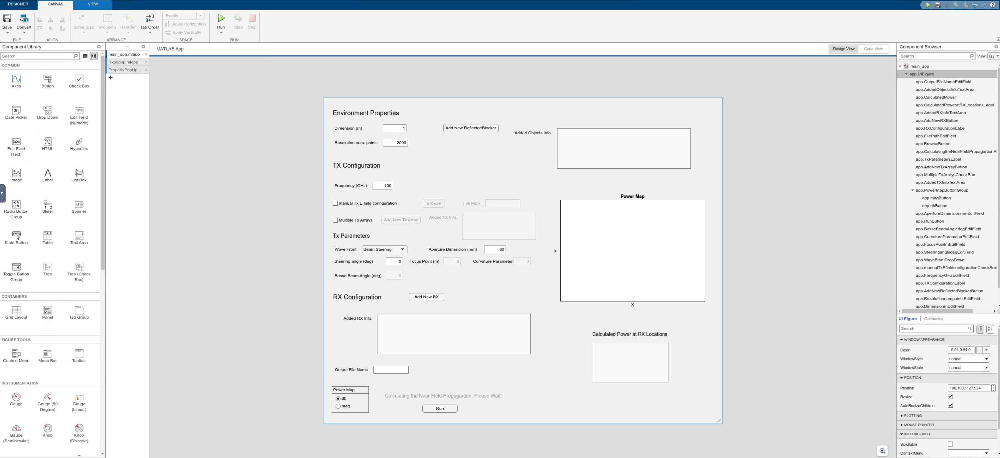
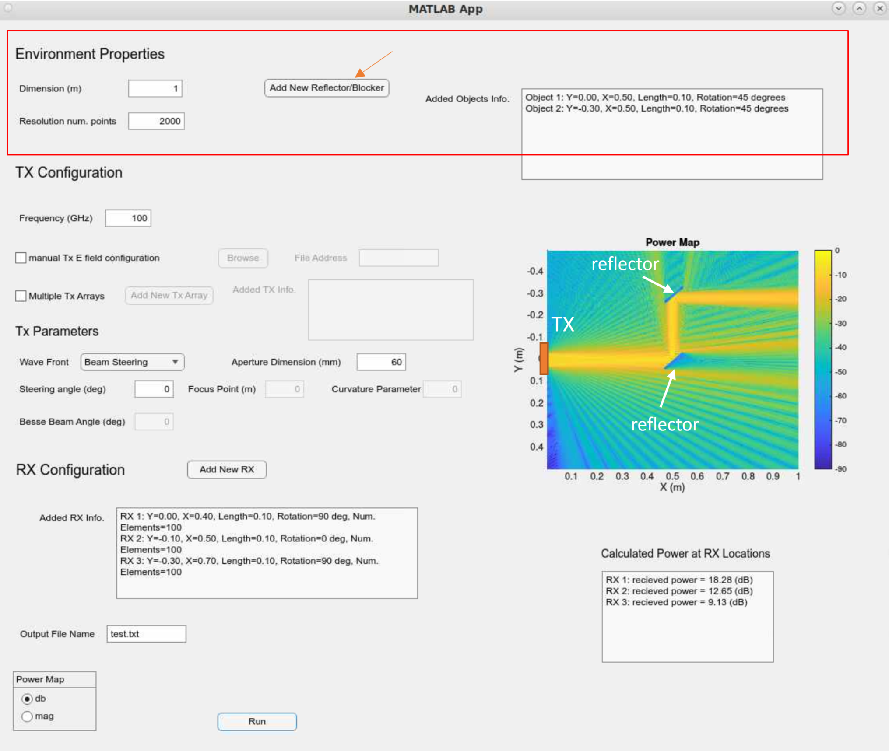
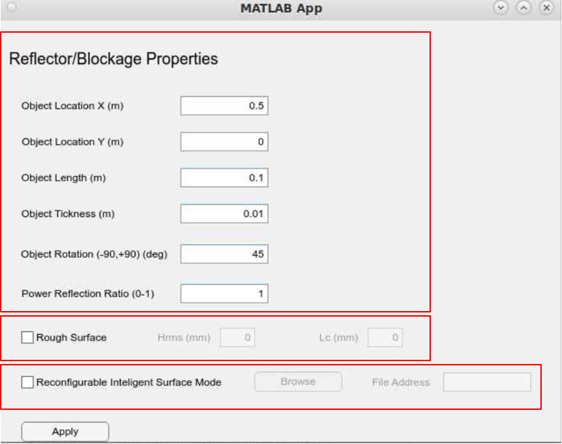
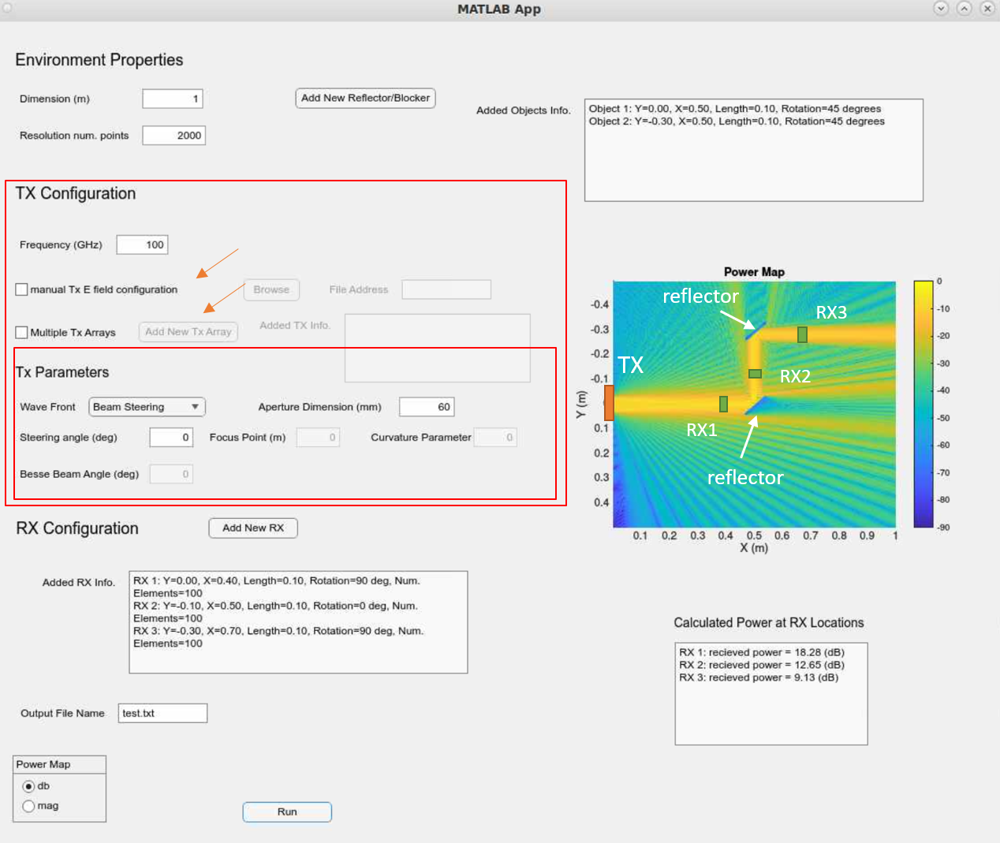
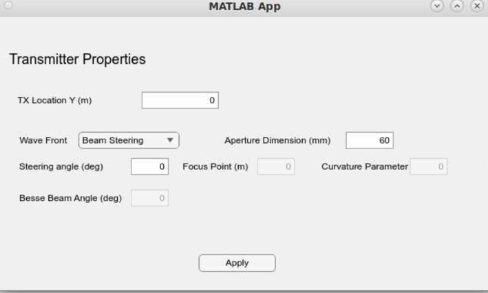
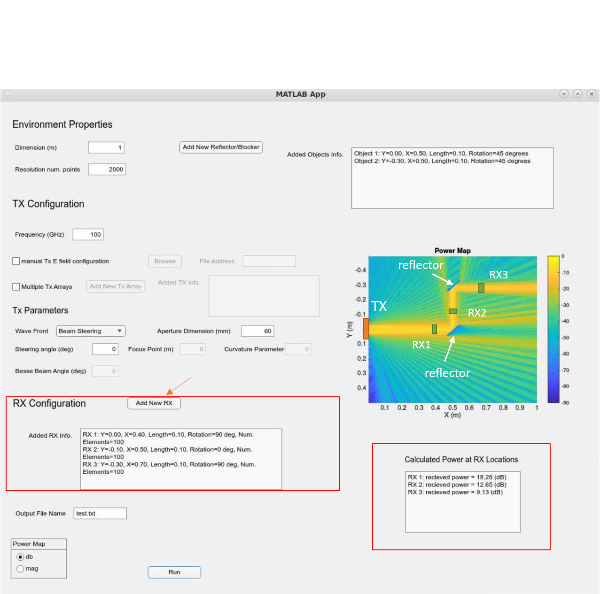
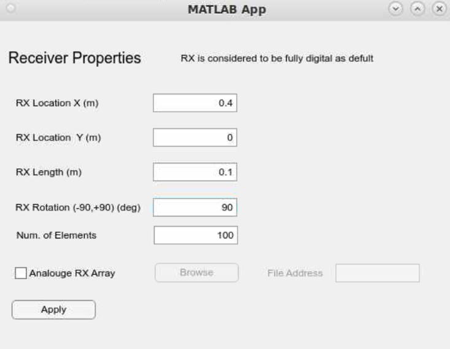

# Near-Field-Propagation-Simulator
"NirvaWave" is an open-source 2D simulator for modeling the electromagnetic wave near field propagation of large transmitter antennas (especially in THz and sub-THz frequencies) in the presence of arbitrary blockages and reflectors in the environment. Terahertz (THz) communications are envisioned to be a key technology in 6G and beyond wireless systems, enabling the demanding high data rates (100 Gbs) and large bandwidths. The large array aperture and high carrier frequencies in the THz band result in a large Rayleigh distance (over 10 meters), which positions most communication applications in the near-field region of the transmitter (Tx) antennas, where the traditional plane-wave assumption is no longer valid. Moreover, the severe propagation loss and blockage issues inherent in the THz band present significant challenges, hindering the system's ability to utilize the available bandwidth effectively. One of the fundamental tools to alleviate these problems and facilitate network optimization and planning is coverage mapping through received power prediction in different locations. However, traditional models developed based on far-field assumptions would fail to capture the near-field characteristics accurately, and running computationally intensive EM simulations on the base stations is not feasible, making effective power prediction extremely challenging for these systems. In this simulator, we provide accurate and efficient modeling of near-field propagation of TX antennas configured with arbitrary phase configurations and locations in interactions with arbitrary numbers of reflectors/blockages with different environmental properties. In this simulator, we provide options to generate interesting and special wavefronts introduced in the near field like Airy beam, Bessel beam, etc., or input user-defined phase configurations for TX antenna elements. Furthermore, "NirvaWave" supports Reconfigurable Intelligent Surfaces (RIS) and rough scattering to model the near-field propagation. Ultimately, one can define the multiple RX properties as in a multiple UEs scenario to get the calculated power at each RX location on top of the coverage map. We have developed this simulator based on the physical principles of Rayleigh-Sommerfeld Integral Theory and Angular Spectrum Method and evaluate its performance by comparing the results generated from this simulator with a comprehensive EM simulator namely "[Feko](https://altair.com/feko)". The main purpose of this simulator is to provide a user-friendly interface to study the near field propagation model of large TX antenna arrays which are envisioned to be the key technology in the next generations of communication systems and more importantly provide an infrastructure to generate a significant amount of data for AI-enabled solutions. 

## Setup and Installation
To start the simulator, first clone the repository:
```
$ git clone https://github.com/vahidyazdnian1378/Near-Field-Propagation-Simulator.git
```

The simulator was implemented in Matlab with GUI. Make sure that [MATLAB](https://de.mathworks.com/products/matlab.html) with version `>2022a`. For intensive computations at high resolutions, it is recommended to run the simulation on a server with sufficient memory and processing power. 

## Starting up the Graphic User Interface

To start the simulator, start [MATLAB](https://de.mathworks.com/products/matlab.html) and open the file *[main_app.mlapp](simulator/main_app.mlapp)* in [MATLAB App Designer](https://de.mathworks.com/products/matlab/app-designer.html). MATLAB App Designer environment can be opened by running the `appdesigner` command in the MATLAB command line. The main app can be set up by easily just running the program.


### Setting Up Environmental Properties
In the first part of the simulator, one can create the environment of interest by choosing the resolution and dimension and adding as many blockages/reflectors with arbitrary properties to the environment.
The resolution represents the number of points in which the electric field is calculated in the defined dimensions. Therefore, if one sets the resolution to be 2000 the output file would be a 2000*2000 complex matrix. The resolution is also important in terms of accurate EM wave propagation. It is recommended to set the resolution so that the sampling space in the defined dimensions is less than $\frac{\lambda}{4}$ (maximum sampling distance required is  $\frac{\lambda}{2}$). The user-defined dimension would depend on the scale of the environment one desires to simulate, it is recommended to extend the dimension at least to the near field region of TX antennas. The results are also valid for far-field region of antenna arrays. It should be noted that increasing the dimension would require more resolution to maintain the sampling condition. 



### Adding Reflector/Blockage
To add a reflector/blockage, one can click on the **Add New Reflector/Blocker** button which would pop up a new window. In the new window, the user can define the location and orientation of the object (within the defined dimensions) along with the length and thickness of the object in the environment. **Power Ratio** determines the amount of power being reflected back with respect to the incident E field power. The power ratio of 1 represents perfect reflection, while the power ratio of 0 represents complete blockage (absorber). Furthermore, there are options to consider diffuse scattering by adding roughness parameters and also to place Reconfigurable Intelligent Surfaces as the reflectors by adding a text file that contains the designed phase shifts on the elements of the RIS. By determining the statistical properties of a rough surface $h_{rms}$ and $L_c$, the code would generate a random surface perturbation and it would be translated to the phase shifts introduced by rough scattering. An example text file to configure a reflector as RIS is included in the [examples](examples) folder named "rough_surf_0.5.txt", which represents the phase shifts of a rough surface, so by adding the RIS to the environment you would see the rough scattering behavior. In order to simulate this example you need to set the dimension to 1m and set the resolution to 2000, the reflector should have a 10cm length and be oriented at 45 degrees. It is recommended to set the TX as the default settings and put the reflector on $X=0.5m$ and $Y=0$. Another example text file to configure a reflector as RIS is included in the [examples](examples) folder named "RIS_non_specular.txt", which represents the phase shifts of RIS to create non-specular reflection, so by adding the RIS to the environment you would see the reflected beam to be redirected to $60^\circ$ instead of $45^\circ$ as the specular angle. In order to simulate this example you need to set the dimension to 1m and set the resolution to 2000, the RIS should have a 20cm length and be oriented at 0 degrees, and placed at $(0.25m,0.25m)$. TX should have $45^\circ$ steering angle and the rest of the properties should be as default. 




### TX Antenna Array Configuration
To configure TX antenna arrays, one should determine the frequency at which the simulation is intended to calculate near-field propagation. It should be noted that the resolution defined in environmental properties must be large enough to sample points with spacing less than half a wavelength $d<\lambda/2$. The default option to configure a TX array assumes the TX to be centered at $Y=0$. The user can define the TX aperture in mm and also the phase configuration by choosing one of the built-in beam types namely **Beam Steering**, **Focused Beam**, **Airy Beam**, and **Bessel Beam**, and set the corresponding parameters. The other option is to set the phase configuration of TX array elements (centered at $Y=0$) manually by importing a text file containing the phase information. The text file should contain complex numbers representing the E field on the $X=0$ plane separated by lines. The third option is to add multiple TX antenna arrays at different locations in the $X=0$ plane and configure them with arbitrary phase configurations. It should be noted that the resolution of the input E field in the manual setting should be equal to the defined environment resolution. A text file *TX_E.txt* with **6000 resolution** can be found in the [examples](examples) folder. The example E field represents two TX antenna arrays with -45 and 35 degree beam steering angles located at 0.5m and -0.5m.




### Adding Multiple RX Antenna Arrays
By clicking on the **Add New RX** button, one can configure the RX antenna dimension, location, orientation, and its number of elements to calculate the received power at the multi-UE scenario by running the simulation once. In default the RX antenna is assumed to be fully digital, however, one can set it to be an analog antenna array by importing the corresponding phase configurations as a text file. The text file should contain the desired phase shifts on each antenna array element in radians and separated by line.




### Coverage Map and Received Power
After running the simulation the calculated coverage map resulting from near field propagation would be visualized and saved as a text file containing the E field at each location based on the pre-defined resolution. Input the desired file name without any extensions. One can change the coverage map visualization mode to be based on normalized magnitude or in db. For more options, you can right-click on the color bar in the figure.  

## AI-enabled System Design
This simulator is a perfect tool to collect data for AI-enabled solutions for different applications of near-field propagation. One can easily make scripts to collect data for various purposes, due to the source code availability of the core simulator. One example of generating a coverage map by interacting with the core near field propagation modeling function can be seen in [func_test.m](scripts/func_test.m) file. For more advanced settings you can also refer to the main function [near_field_propagation.m](simulator/near_field_propagation.m).

## License and Citation
NirvaWave simulator is MIT licensed, as found in the [LICENSE](./LICENSE) file.
